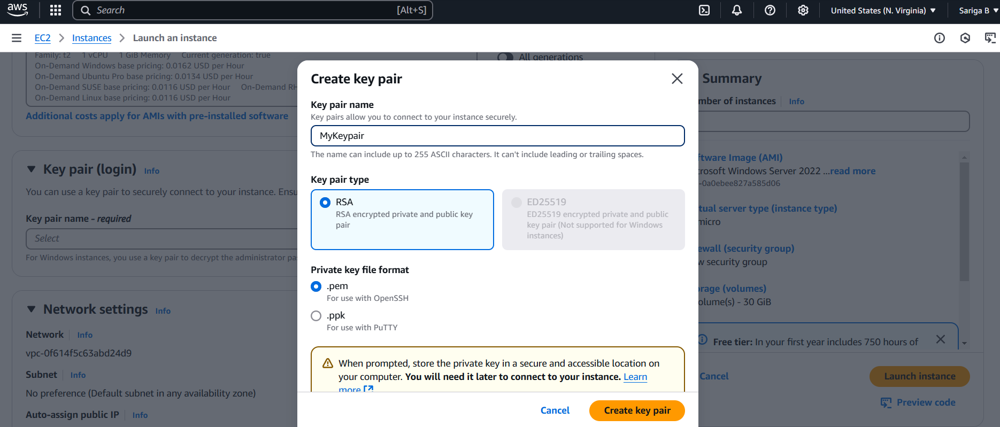
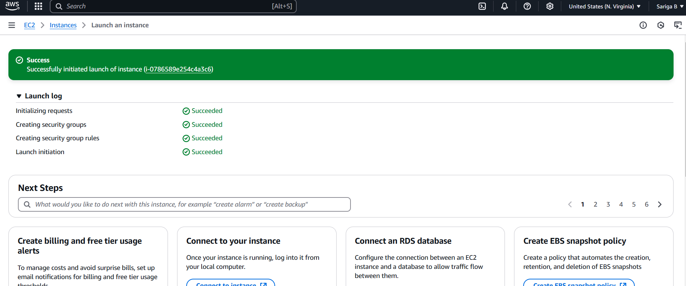
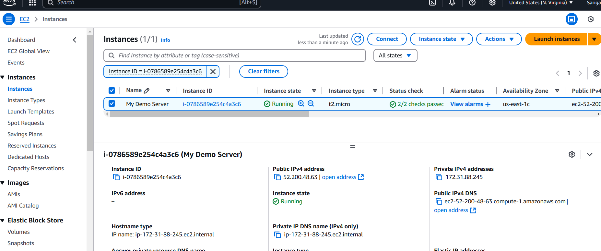
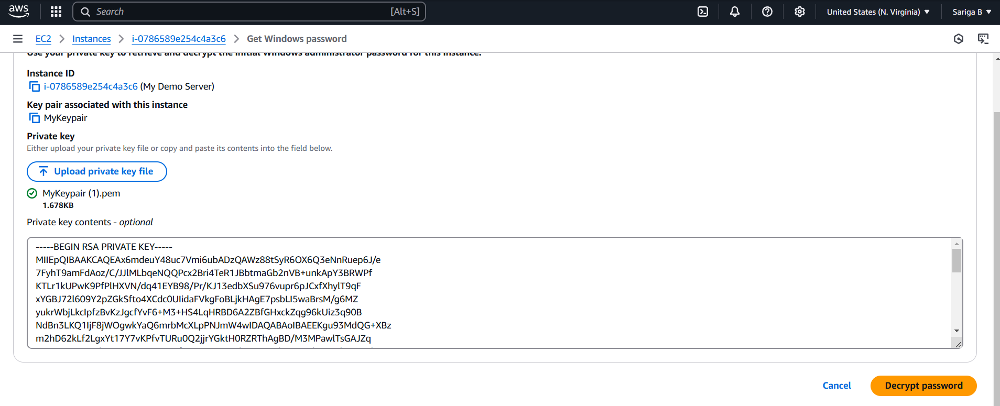
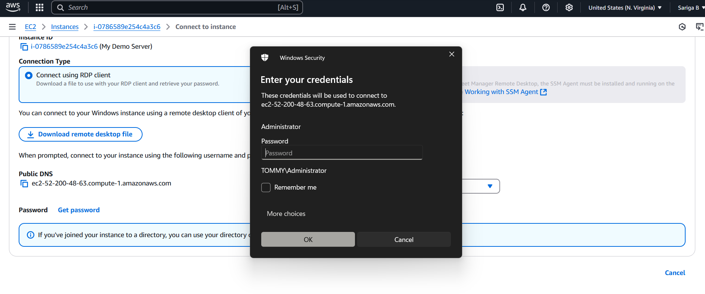
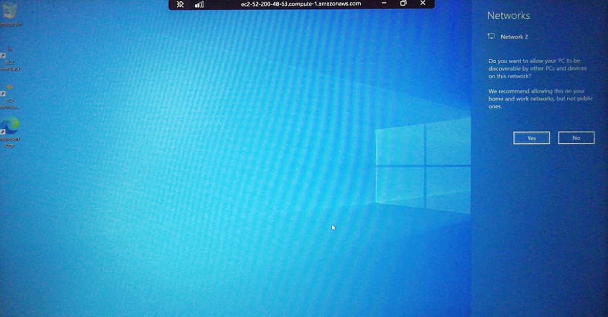

# Ec2--project
Steps of the project
1. Launch Ec2 Instance:
   Go to AWS Management Console and navigate to Ec2 Dashboard
   click on Launch Instance.
   
2. Select Application and OS image (AMI):
   Choose Amazon Machine Image(AMI) with Windows as the Operating system.

3. 
   Create new Key Pair and Download the file and store it securly, as it is required to decrypt the password.

4. Launch the Instance:
   
   

6. Connect to Instance via RDP:
   Click connect and select RDP client.
   Download Desktop File - Click on Get Password and upload keypair file to decrypt the Windows Administrator Password.

7. 

8. RDP Connection:
   

9. Windows Screen out in the cloud:
   
